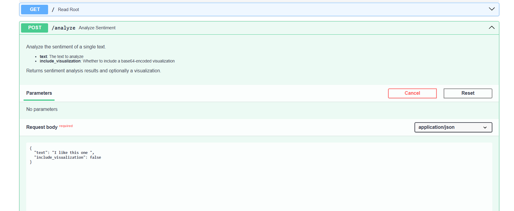

# 🚀 How to Run the Sentiment Analysis API Container

## 1. Pull the Docker Image

```bash
docker pull bejoy1514/sentiment-analyzer-api:latest
```

---

## 2. Run the Container

```bash
docker run -d \
  --name sentiment-analyzer-api \
  -p 8000:8000 \
  -v ~/.cache/huggingface:/app/transformers_cache \
  bejoy1514/sentiment-analyzer-api:latest
```


## 3. Access the API

Open your browser and go to:

[http://localhost:8000/docs](http://localhost:8000/docs)


You will see an interactive **FastAPI Swagger UI** to test the API endpoints.

---

## 4. Useful Commands

- **Stop the container:**
  ```bash
  docker stop sentiment-analyzer-api
  ```

- **Start the container again:**
  ```bash
  docker start sentiment-analyzer-api
  ```

- **View logs:**
  ```bash
  docker logs sentiment-analyzer-api
  ```

- **Remove container:**
  ```bash
  docker rm -f sentiment-analyzer-api
  ```

---

## 📅 Notes
- Make sure Docker has enough resources (at least 2 CPUs and 4 GB RAM).
- If you update the code, rebuild the image and re-run the container.
- Hugging Face models are cached to avoid re-downloading every time.
